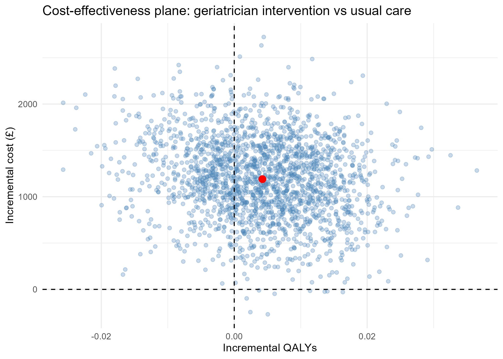

# UK Trial-Based Economic Evaluation: AMIGOS

## Overview

This project conducts a trial-based economic evaluation using publicly available
patient-level data from the AMIGOS randomised controlled trial, which compared a
geriatrician-led case management intervention against usual care for older people
discharged from an acute medical unit.

## Objective

To develop practical experience analysing UK clinical trial data, including
healthcare resource use, costs, EQ-5D, and QALYs, and to produce a reproducible
cost-effectiveness analysis.

## Data

AMIGOS randomised controlled trial (n = 417).

The original dataset is not redistributed in this repository, as it contains
patient-level data. It is available from the original data repository, subject
to its terms of use.

## Methods

- Data cleaning and quality assessment
- Patient-level resource-use analysis
- UK EQ-5D-3L utility estimation (TTO value set, Dolan 1997)
- QALY calculation (area-under-the-curve method)
- Cost analysis using HRG- and treatment-function-code-level unit costs from the
  NHS National Schedule of Reference Costs 2011-12 (matching the trial's HRG4-era coding)
- Incremental cost-effectiveness analysis (unadjusted and baseline-adjusted)
- Uncertainty analysis via non-parametric bootstrap (cost-effectiveness plane, CEAC)

## Software

R / RStudio. Key packages: readxl, dplyr, eq5d, ggplot2, boot.

## Project structure

```
R/            - analysis scripts (01_import_cleaning -> 04_analysis)
data/         - raw data (not tracked) and unit cost lookups (tracked)
output/       - generated tables and figures
docs/         - preliminary report
```

## Results

**Baseline (n = 417):** the two arms were reasonably balanced on age (82.7 vs 82.9) and
comorbidity (Charlson 1.56 vs 1.55), with a modest baseline utility imbalance (0.499 vs 0.525)
that motivated a baseline-adjusted analysis alongside the unadjusted one.

**Cost and QALYs (complete cases, n = 254):**

| Arm | n | Mean cost | Mean QALY (90 days) |
|---|---|---|---|
| Usual care | 127 | £3,755.57 | 0.1149 |
| Geriatrician intervention | 127 | £5,149.00 | 0.1192 |

**Incremental cost-effectiveness:**

| Analysis | Incremental cost | Incremental QALY | ICER |
|---|---|---|---|
| Unadjusted | £1,393.43 | 0.0042 | £328,856/QALY |
| Adjusted (baseline utility) | £1,403.96 | 0.0024 | £581,326/QALY |

The intervention costs more with a small, uncertain QALY gain; both ICERs are far above
conventional UK thresholds (£20,000-£30,000/QALY). The cost-effectiveness acceptability
curve stays below ~6% probability of cost-effectiveness across £0-£50,000/QALY.



## Limitations

- Complete-case analysis retained only 254/417 patients (61%) for cost/QALY estimation;
  multiple imputation would be the appropriate next step rather than dropping missing follow-up.
- QALYs for patients who died assume a linear utility decline to zero at date of death.
- Costs use the NHS National Schedule of Reference Costs 2011-12 (matching the trial's HRG4-era
  coding); 2 of 155 HRG codes (~2.7% of inpatient episodes) were unmatched and costed as £0.
- Intervention delivery time uses a single fixed hourly wage rate rather than per-patient variation.
- This is an independent, self-directed replication for methods practice, not a validated
  reproduction of the original trial's published economic evaluation.

## Status

Preliminary exploratory analysis, complete.